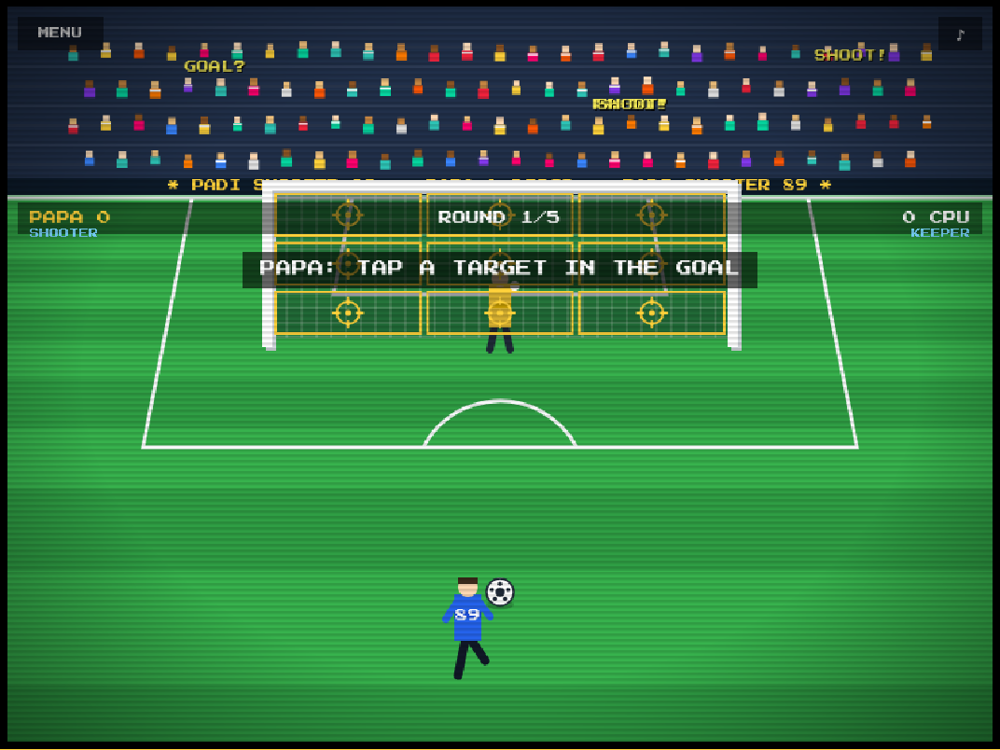

<!-- markdownlint-disable MD033 MD041 -->
<div align="center">

# ⚽ PaDi Shooter 89

### _The retro penalty shoot-out game_

**PA** = Papa · **DI** = Diogo
🎉 The very first video game made by **Carlos & Diogo Sardo** 🎉

[](https://carlossardo.github.io/padishooter89/)
[](LICENSE)
[](#%EF%B8%8F-tech)

<br />

<a href="https://carlossardo.github.io/padishooter89/">
  
</a>

</div>

---

## 🎮 Play it now

👉 **[carlossardo.github.io/padishooter89](https://carlossardo.github.io/padishooter89/)**

No installs. No downloads. It runs right in your browser — on **phones, tablets and
computers**. Just open the link and shoot! 🥅

> 🔊 **Turn the sound on** for the full stadium experience — referee whistle, roaring
> crowd, goal music and more. (Audio starts on your first tap, because browsers ask
> nicely first.)

---

## 🌟 About

This is a tiny labour of love: a dad and his son making their **first game together**.
It's a super retro, **8-bit style football (soccer)** penalty shoot-out, built from
scratch with nothing but **HTML, CSS and JavaScript** — no frameworks, no game engine,
no build step. Even the music and sound effects are generated in code! 🎶

---

## ✨ Features

| | |
|---|---|
| 🕹️ **Retro 8-bit look** | Pixel font, CRT scanlines, chunky pixel players |
| 👥 **1 or 2 players** | Beat a friend, or take on the **CPU** (Easy / Normal / Hard) |
| 💪 **Power control** | Pick your shot power from **1% to 100%** |
| 🎯 **9 aim zones** | Top / middle / bottom × left / centre / right |
| 🧤 **Be the keeper** | Pick where to dive and make the save |
| 🗣️ **Living crowd** | Fans jump, cheer, boo and **shout** — with confetti on a goal! |
| 🎺 **Retro audio** | Whistle, kick, goal anthem, save & miss sounds + chiptune music |
| 🏆 **Local leaderboard** | High scores saved on your device |
| 📱 **Mobile friendly** | Designed for touch and small screens |

---

## 🕹️ How to play

It's a penalty shoot-out! **5 penalties each.** Every turn the two players swap between
being the **SHOOTER** and the **GOALKEEPER**.

### 🥅 When you are the SHOOTER
1. **Tap a target** — pick one of the 9 glowing targets in the goal.
2. **Set the power** — a bar swings from 1% → 100%. **Tap again** to lock it and SHOOT!
   - More power is harder to save… but aim for the top corners at full power and you
     might blast it wide! ⚡ Risk vs reward.

### 🧤 When you are the GOALKEEPER
- **Tap where you want to dive** before the ball is struck.
  Dive to the same zone as the shot and it's a guaranteed save! _(In 2-player mode,
  the shooter should look away 🙈)_

### 🏆 Winning
- Most goals after **5 rounds** wins.
- A tie goes to **SUDDEN DEATH** — keep shooting until someone wins! 💥

---

## 🎛️ Controls

| Action | Touch / Mouse | Keyboard |
|---|---|---|
| Pick target / dive | Tap a zone | — |
| Lock power & shoot | Tap anywhere | `Space` or `Enter` |
| Continue after a result | Tap | `Space` or `Enter` |
| Mute / unmute | Tap the ♪ button (top-right) | `M` |

---

## 💻 Run it locally

Want to tinker? It's just static files.

```bash
# 1. Clone the repo
git clone https://github.com/CarlosSardo/padishooter89.git
cd padishooter89

# 2a. Easiest: just open index.html in your browser
#     ...or...

# 2b. Nicer: serve it (sound & fonts load best over http)
python3 -m http.server 8089
# then open http://localhost:8089
```

> 💡 In VS Code you can also right-click `index.html` → **Open with Live Server**.

---

## 🗂️ Project structure

```text
padishooter89/
├── index.html          # the page + all the menus
├── css/
│   └── style.css       # the retro look (pixel UI, CRT scanlines, responsive)
└── js/
    ├── audio.js        # chiptune sound engine (Web Audio API — all in code!)
    ├── leaderboard.js  # saves high scores (localStorage)
    ├── crowd.js        # the cheering pixel fans
    └── game.js         # the game: field, goal, keeper, ball, rules, input
```

---

## 🛠️ Tech

- **Pure web stack:** HTML + CSS + vanilla JavaScript. No frameworks, no build tools.
- **Rendering:** a single HTML5 `<canvas>` drawn with `requestAnimationFrame`.
- **Sound:** the **Web Audio API** — every whistle, kick, cheer and the background tune
  is synthesised at runtime (no audio files in the repo!).
- **Storage:** `localStorage` for the leaderboard.
- **Hosting:** static, served by **GitHub Pages**.

---

## 🗺️ Ideas for the future

A few things we might add (pull requests welcome! 👇):

- [ ] More stadiums and kit colours
- [ ] Curve / swerve on the ball
- [ ] Tournament / world-cup mode
- [ ] Online high-score sharing
- [ ] More crowd chants and animations

---

## 🤝 Contributing

This is a family project, but we'd **love** for you to join in! 💛

1. **Fork** the repo.
2. Create a branch: `git checkout -b my-cool-feature`.
3. Make your change (keep it simple — vanilla HTML/CSS/JS, no build step).
4. Test it in the browser (try it on a phone too 📱).
5. Commit & push, then open a **Pull Request** describing what you did.

Found a bug or have an idea? **[Open an issue](https://github.com/CarlosSardo/padishooter89/issues)** —
all suggestions are welcome, especially friendly ones for young game makers. 🙂

---

## 📜 License

Released under the **[MIT License](LICENSE)** — free to play, learn from, and build upon.

---

<div align="center">

### Made with ⚽, 🎶 and a lot of ❤️ by **Carlos & Diogo Sardo**

_Our first game. We hope it makes you smile._ **GOOOAL!** 🎉

</div>
